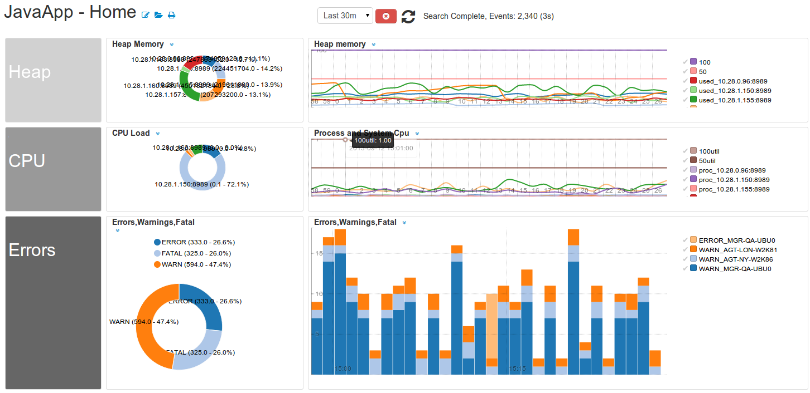
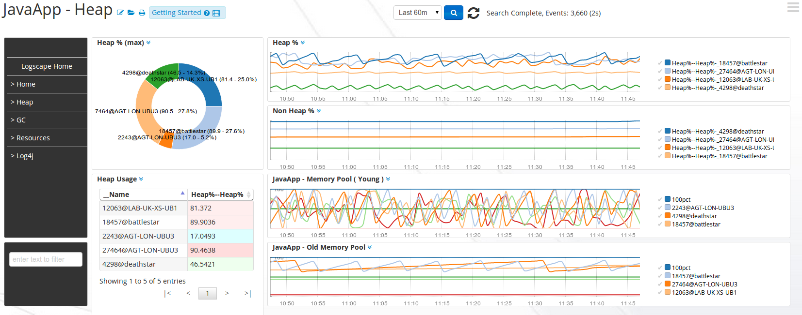
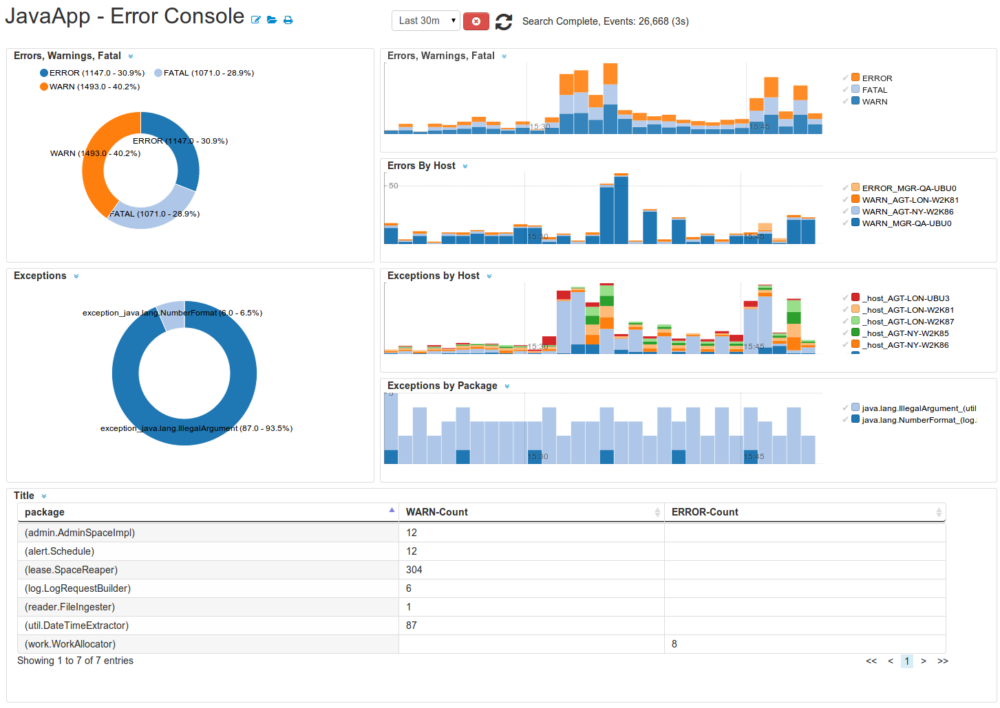

# JavaApp-1.0

Monitor Java based applications such as Tomcat, JBoss, ActiveMQ via jmx. Provides charts and alerts on Heap Memory allocation,GC Activity and log4j logs. Provides extensive monitoring and logging for PROD and devops environments

# Downloads 

Read [How to deploy](http://logscape.github.io/deploy.html) for basic App installation instructions  
Read [How to import data](http://logscape.github.io/ds-add.html) to learn about data sources

Download and deploy:  

 *  [JavaApp-1.0.zip](https://github.com/logscape/javaapp/blob/master/dist/JavaApp-1.0.zip?raw=true)  
 *  [JavaApp-1.0-overrides.properties](https://github.com/logscape/javaapp/blob/master/dist/JavaApp-1.0-override.properties)

# Installation 

## Log4J 

 Create a datasource for each applicaiton you would like to monitor. Naming datasources according to application and environment help in organising your searches. For example, a system administrator may be in charge of tomcat servers in DEV,UAT and PROD environments; he may choose his datasources

	tomcat-dev
	tomcat-uat
	tomcat-prod

## Garbage Collection logging

Update your java applications JAVAOPTS to switch on GC Logging. 

	-Xloggc:app0gc.log -XX:+UseGCLogFileRotation  -XX:GCLogFileSize=1M 

Create a datasource for your gc logs e.g 

	tomcat-gc 

## JMX Monitoring 

 Configure your environment using the application override file. It is required for JMX  statistics.
Here's an example application override monitoring 3 Logscape agents. 

	*.group0.host=10.28.1.160,10.28.1.150,10.28.1.155
	*.group0.ports8989
	*.grouo0.label=logscape

The above configuration will connect to each host on port 8989 and collect JMX data. The jmx data from this host will contain a label 'logscape'. The label is used to describe a group of similar applictions. In this case they happen to be Logscape agents. My next group of java processes are all tomcat. 

	*.group1.host=10.28.1.170,10.28.1.171
	*.group1.ports=9010
	*.group1.label=tomcat

You can define as many groups as you like in the overrides file. Once you have finished configuring your environment you can upload the file on the DEPLOY page. There is no need to click DEPLOY since it is not an App 

## Agent Type

The JavaApp by default will run on any Indexer named JmxIndexer or any agent that contains the name JmxIndexer. The following names are examples that fit this pattern

 * JmxIndexer
 * DevJmxIndexer
 * UatJmxIndexer 
 * PRODJmxIndexer 

You can make this App run on any Indexer,Indexstore or Forwarder of your choice by adding the following line to your overrides file

	bundle.defaults.resourceSelection=type contains XXX

XXX is the name of your Indexer,Indexerstore or Forwarder.  Here are a few examples
	
	JbossIndexer
	J2EEForwarder
	TraderServerIndexStore 

# Overview 

  

# Heap and Memory Pools 

 

# Log4j logs 

  

